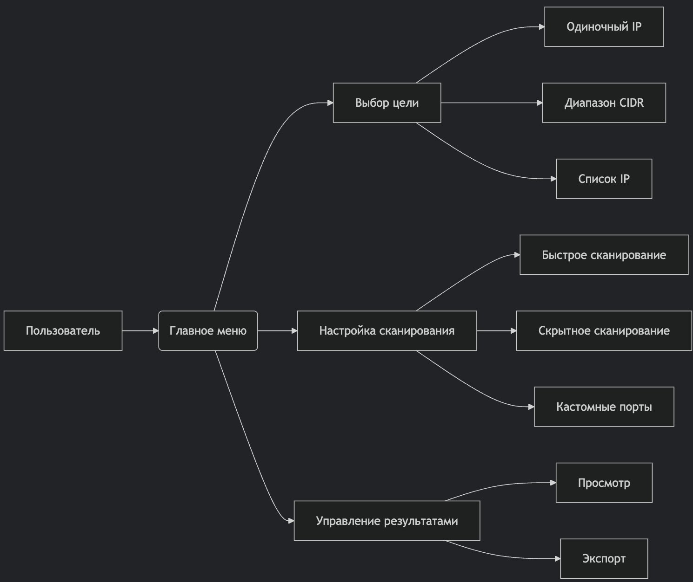

# ADAPTIVE-NET-SCAN - Интеллектуальный сканер сетей


**ADAPTIVE-NET-SCAN** - это продвинутый инструмент для скрытного сканирования сетей, автоматически адаптирующийся под доступные ресурсы системы. Разработан для специалистов по кибербезопасности, системных администраторов и энтузиастов CTF.

## 🌟 Ключевые особенности

- **Автоматическая адаптация** - использует доступные инструменты (Nmap, Netcat, Hping3)
- **Скрытные методы сканирования** - обфускация трафика, случайные задержки
- **Защита результатов** - AES-256 шифрование данных
- **Интуитивный интерфейс** - интерактивное TUI-меню
- **Модульная архитектура** - легко расширяемый функционал
- **Кросс-платформенность** - работает на Linux, macOS, Windows (WSL)

## 📦 Установка

```bash
# Клонировать репозиторий
git clone https://github.com/yourusername/ADAPTIVE-NET-SCAN.git

# Перейти в директорию проекта
cd ADAPTIVE-NET-SCAN

# Дать права на выполнение
chmod +x main.sh

# Запустить
./main.sh
```

## 🛠 Требования

- **Минимальные:**
  - Bash 4.0+
  - GNU Core Utilities
  - GPG (для шифрования)

- **Рекомендуемые:**
  - Nmap (для продвинутого сканирования)
  - Netcat/Hping3 (альтернативные методы)
  - Arp-scan (для обнаружения хостов)

## 🚀 Использование

Просто запустите скрипт и следуйте инструкциям меню:

```bash
./main.sh
```

### Основные функции:
1. **Выбор цели сканирования**
   - Одиночный IP
   - Диапазон CIDR
   - Список из файла
   - Автоопределение локальной сети

2. **Настройка параметров**
   - Выбор типа сканирования
   - Настройка уровня скрытности
   - Указание портов

3. **Управление результатами**
   - Автоматическое шифрование
   - Просмотр результатов
   - Экспорт данных

## 🗂 Структура проекта

```
ADAPTIVE-NET-SCAN/
├── main.sh                    # Главный скрипт
├── config/
│   └── default.conf           # Конфигурация по умолчанию
├── modules/
│   ├── menus.sh               # Система меню
│   ├── scanner.sh             # Логика сканирования
│   ├── encryption.sh          # Шифрование/дешифровка
│   └── tools.sh               # Проверка зависимостей
├── lib/
│   ├── helpers.sh             # Вспомогательные функции
│   └── logging.sh             # Система логгирования
├── plugins/                   # Плагины сканирования
│   ├── nmap_plugin.sh
│   ├── netcat_plugin.sh
│   └── hping_plugin.sh
├── output/                    # Результаты сканирования
└── docs/                      # Документация
```

## 🧩 Разработка плагинов

Чтобы добавить новый метод сканирования, создайте файл плагина в директории `plugins/`:

```bash
touch plugins/newscan_plugin.sh
```

Шаблон плагина:
```bash
#!/bin/bash

# Регистрация плагина
register_plugin() {
    PLUGIN_NAME="New Scan Method"
    PLUGIN_DESCRIPTION="Описание вашего плагина"
    PLUGIN_COMMAND="newscan"
    PLUGIN_SCAN_TYPES=("newscan")
}

# Функция сканирования
run_newscan_scan() {
    local target=$1
    local output=$2
    
    # Ваша логика сканирования
    echo "Сканирование $target методом newscan" > "$output"
}
```

## 📊 Примеры работы

### Сканирование сети:
```bash
[2023-10-15 14:30:45][INFO] Запуск скрытого сканирования сети 192.168.1.0/24
[2023-10-15 14:35:18][SUCCESS] Обнаружено 12 активных хостов
[2023-10-15 14:37:22][INFO] Результаты зашифрованы: output/scan_4b3c8a2f.gpg
```

## 🤝 Участие в разработке

Приветствуются все виды вклада в проект:
1. Сообщения об ошибках (Issues)
2. Запросы на добавление функций (Feature Requests)
3. Пулл-реквесты (Pull Requests)

Перед внесением изменений, пожалуйста, обсудите их в Issues.

## 📞 Контакты

Автор проекта: Ar4Balt  
Email: tunnikovartur@gmail.com  
Telegram: @Ar4Balt  

[](https://github.com/yourusername/ADAPTIVE-NET-SCAN/issues)
[](https://opensource.org/licenses/MIT)
[](https://github.com/yourusername/ADAPTIVE-NET-SCAN/releases)

---



**ADAPTIVE-NET-SCAN** - профессиональный инструмент для этического хакинга и аудита безопасности. Используйте только с явного разрешения владельцев сканируемых систем.